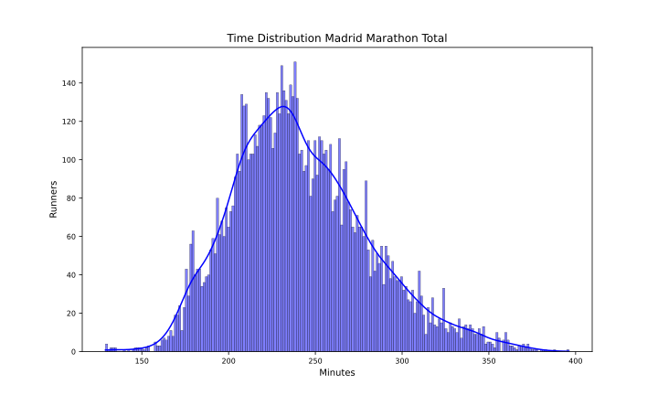
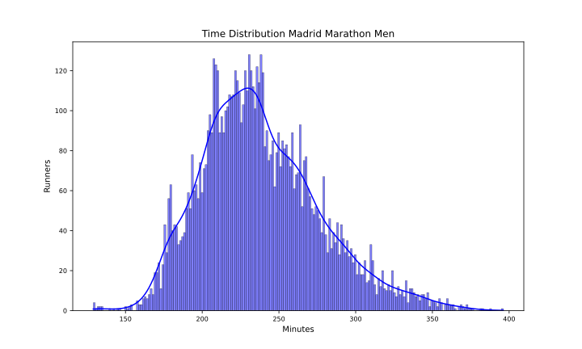
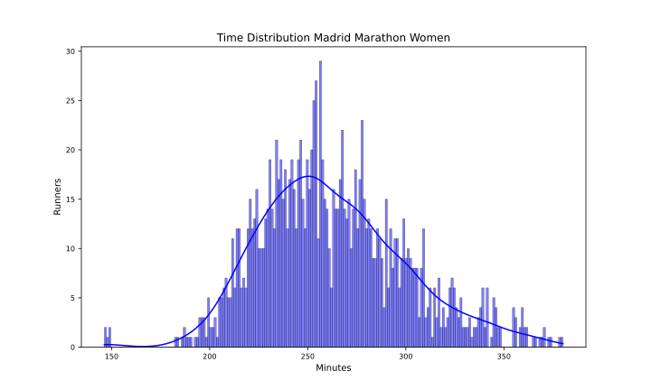

Madrid-2024
===========

# Datos del maratón de Madrid 2024

El maratón de Madrid 2024 ha tenido 9125 finishers, de los que 1384 fueron mujeres, lo que supone un 15.17% del total.

El tiempo medio de todos los participantes ha sido 4:01:54, el de los hombres 3:58:12 y el de las mujeres 4:22:54.

El tiempo medio del 10% más rápido ha sido 3:01:24, y el del 25% 3:15:48.El tiempo medio de los 100 primeros ha sido 2:38:36, y para los 1000 primeros 3:02:42.

En esta tabla se resume el número de finishers por espacios de tiempos y el porcentaje respecto al total:  

|Tiempo|Finishers|%|
| :---: | :---: | :---: |
|Sub2:10|4|0.04|
|Sub2:20|11|0.12|
|Sub2:30|20|0.22|
|Sub2:45|59|0.65|
|Sub3:00|364|3.99|
|Sub3:30|1953|21.4|
|Sub4:00|4865|53.32|

Por último, en cuanto al resumen general, la primera media maratón tiene un tiempo medio de 1:54:00 y la segunda de 2:07:00 con un 7.82% de Negative Pace. Para los hombres, la primera media maratón tiene un tiempo medio de 1:52:12 y la segunda de 2:05:06 con un 7.78% de Negative Pace. Y para las mujeres, la primera media maratón tiene un tiempo medio de 2:04:00 y la segunda de 2:17:30 con un 8.09% de Negative Pace.

Las siguientes imágenes muestran la distribución de tiempos de los corredores en el maratón por género:  
  
  

## Datos por tramos de 5 kms

A continuación se muestran los datos de los corredores por tramos de 5 kms: 5K, 10K, 15K, 20K, 25K, 30K, 35K y 40K.

El"%" de errores de chip por cada punto de control es:  

|Punto|%|
| :---: | :---: |
|05K|0.82|
|10K|0.73|
|15K|0.62|
|20K|0.44|
|HALF|0.34|
|25K|0.64|
|30K|0.41|
|35K|0.33|
|40K|5.19|

Eliminamos los corredores con errores en algún punto de control.

El 5K más rápido para los hombres ha sido: 0:14:30. En la siguiente tabla se muestran los tiempos medios y más rápidos de los hombres por tramos de 5 kms:

| Point   | Mean    | Min     |
|:--------|:--------|:--------|
| 05Km    | 0:26:48 | 0:15:30 |
| 10Km    | 0:25:42 | 0:14:42 |
| 15Km    | 0:26:18 | 0:14:42 |
| 20Km    | 0:26:48 | 0:14:36 |
| 25Km    | 0:27:00 | 0:14:30 |
| 30Km    | 0:28:30 | 0:15:00 |
| 35Km    | 0:29:30 | 0:15:12 |
| 40Km    | 0:31:00 | 0:15:48 |

El 5K más rápido para las mujeres ha sido: 0:16:54. En la siguiente tabla se muestran los tiempos medios y más rápidos de las mujeres por tramos de 5 kms:

| Point   | Mean    | Min     |
|:--------|:--------|:--------|
| 05Km    | 0:29:30 | 0:17:48 |
| 10Km    | 0:28:18 | 0:16:54 |
| 15Km    | 0:29:00 | 0:16:54 |
| 20Km    | 0:29:48 | 0:17:12 |
| 25Km    | 0:30:00 | 0:17:06 |
| 30Km    | 0:31:54 | 0:17:30 |
| 35Km    | 0:32:30 | 0:17:48 |
| 40Km    | 0:33:36 | 0:17:48 |

Para terminar con el estudio de los tramos de 5 kms, en las siguientes tablas se muestra el porcentaje de corredores que han hecho el tramo más rápido y más lento:

| index   |     % |
|:--------|------:|
| 10Km    | 73.74 |
| 25Km    | 10.6  |
| 15Km    |  6.1  |
| 05Km    |  3.51 |
| 40Km    |  2.37 |
| 20Km    |  1.57 |
| 35Km    |  1.55 |
| 30Km    |  0.57 |

| index   |     % |
|:--------|------:|
| 40Km    | 70.55 |
| 35Km    | 10.08 |
| 05Km    |  8.82 |
| 30Km    |  6.61 |
| 20Km    |  1.92 |
| 25Km    |  1.13 |
| 15Km    |  0.61 |
| 10Km    |  0.28 |